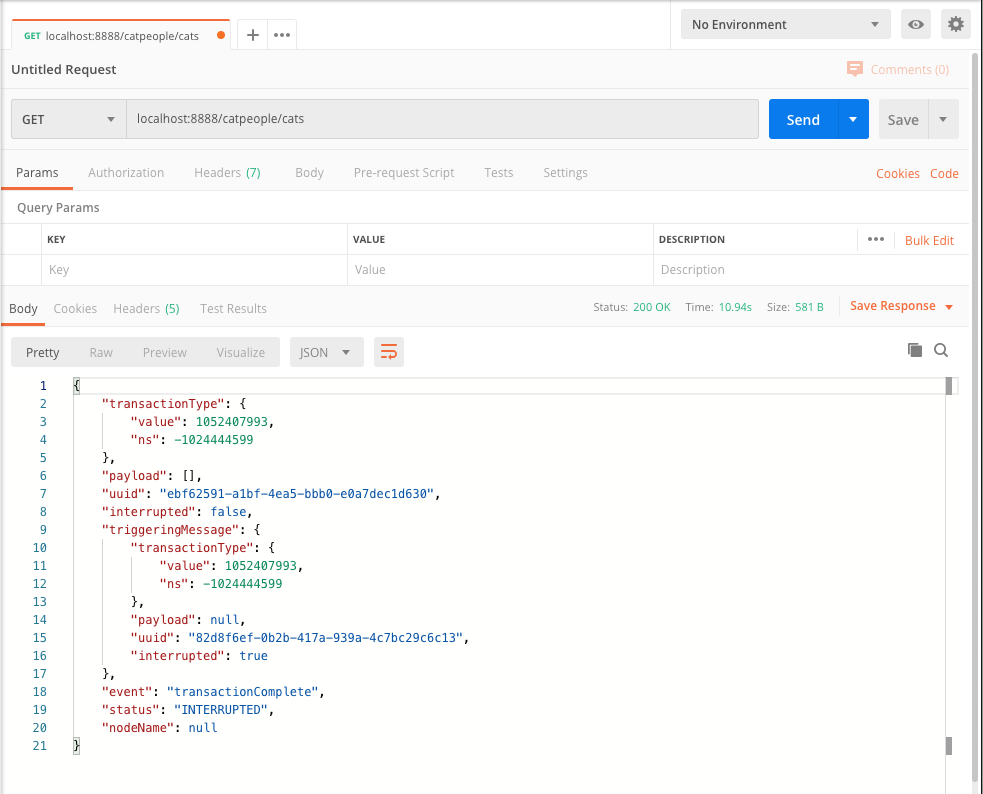
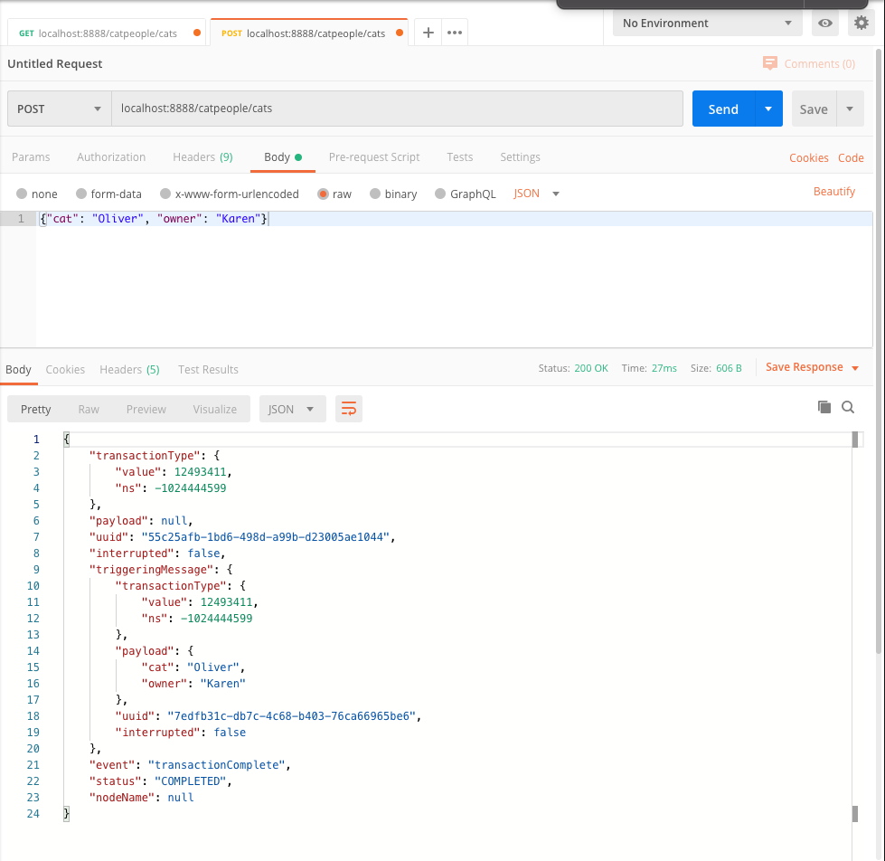
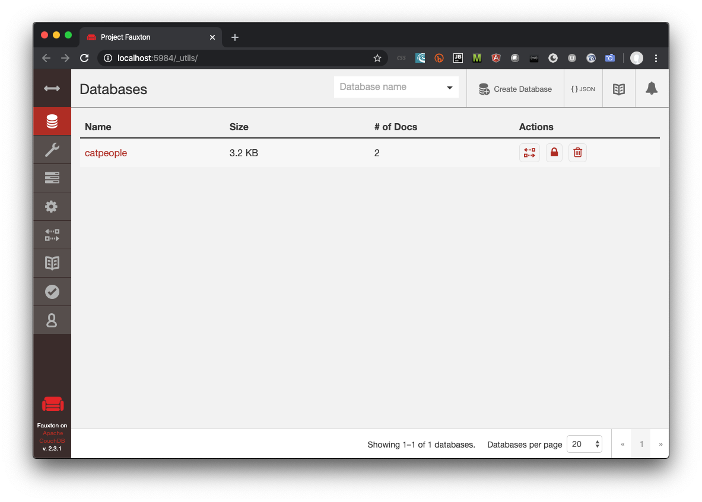
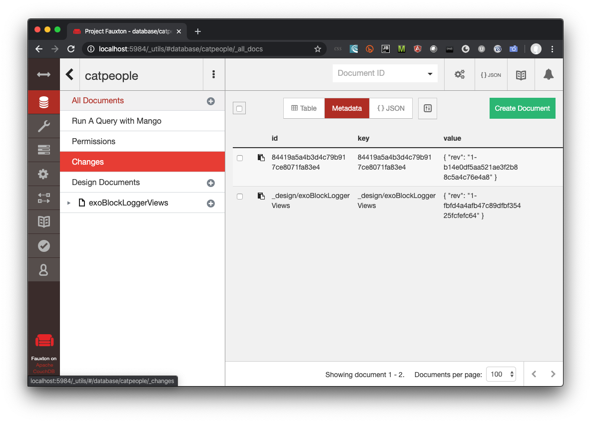
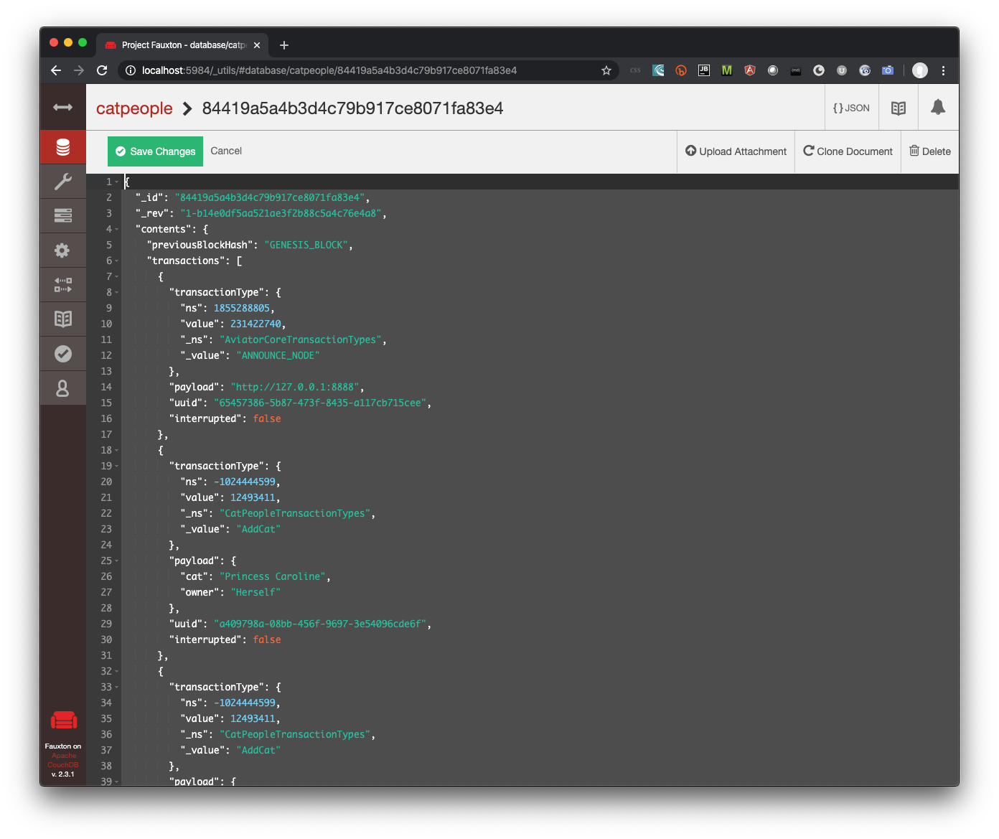

Build our Main Program and Run the Application
==============================================

In Eclipse, right-click on the src/main/java folder in the package explorer and select New Class.  Name the new class "CatPeople" to match our main class from the pom.xml file.  This class serves as the entry point when our application runs.  It's very simple - it only needs to set up the shared state and initialize Aviator with a consensus plug-in.

We're going to start with the "test" consensus mechanism, which simulates how your application will run when it's connected to a real network without having to go through the effort to set one up.

```java
import com.organization.catpeople.state.CatPeopleState;
import com.txmq.aviator.core.Aviator;
import com.txmq.aviator.core.AviatorTestConsensus;

public class CatPeople {

	/**
	 * All we need to do here is configure our copy 
	 * of the shared state and the core framework.
	 * @param args
	 */
	public static void main(String[] args) {
		try {
			AviatorTestConsensus consensus = new AviatorTestConsensus();
			consensus.initState(CatPeopleState.class);
			Aviator.init(consensus);
		} catch (ReflectiveOperationException e) {
			// TODO Auto-generated catch block
			e.printStackTrace();
		}
	}

}

```

In our main program, we start by instantiating the `AviatorTestConsensus` plug-in.  We then tell the consensus mechanism what class to use for our shared state.  Finally, we call Aviator.init(), passing in our configured consensus plug-in instance.

Starting the Application
------------------------

The moment we've all been waiting for has arrived!  We're just about ready to build and run our application.  Before we do, recall that we added and configured Aviator's CouchDB Block Logger plug-in.  That means we'll need a CouchDB.  If you're running Docker, it's super easy to start one up.  From your terminal, run:
```
docker run -p 5984:5984 -d couchdb
```

Now that we have our CouchDB up, we can run the application.  In Eclipse, right-click on our main program and select Run As -> Java Application or Debug As -> Java Application.  When the application starts up, you'll see some output in the console window similar to this:

```
Adding routes for messageReceived in package com.organization.catpeople
Adding routes for executePreConsensus in package com.organization.catpeople
Adding routes for executeConsensus in package com.organization.catpeople
Adding routes for submitted in package com.organization.catpeople
Adding routes for preConsensusResult in package com.organization.catpeople
Adding routes for consensusResult in package com.organization.catpeople
Adding routes for transactionComplete in package com.organization.catpeople
public static void com.txmq.aviator.blocklogger.AviatorBlockLoggerBootstrapper.startup()
public static void com.txmq.aviator.rest.AviatorRESTBootstrapper.startup()
Attempting to start Grizzly on http://0.0.0.0:8888
Feb 19, 2020 12:44:00 PM org.glassfish.grizzly.http.server.NetworkListener start
INFO: Started listener bound to [0.0.0.0:8888]
Feb 19, 2020 12:44:00 PM org.glassfish.grizzly.http.server.HttpServer start
INFO: [HttpServer] Started.
Starting Grizzly
Feb 19, 2020 12:44:00 PM org.glassfish.grizzly.http.server.NetworkListener start
INFO: Started listener bound to [0.0.0.0:9888]
Feb 19, 2020 12:44:00 PM org.glassfish.grizzly.http.server.HttpServer start
INFO: [HttpServer-1] Started.
Reporting available REST API at http://127.0.0.1:8888
Routing f033864d-b53e-422c-8721-dfbf63a357fe to executeConsensus on null
```

We can see from the output that Aviator has detected some handlers and subscribers in our com.organization.catpeople project, and that it has bootstrapped both the block logger and the Aviator REST Server.

To interact with our application, you can use a command line tool like cURL on MacOS or Linux, but you'll want to use a REST API tool such as [Postman](https://www.postman.com/).  Let's start by asking for the list of cats and owners registered on the application.  Since the application has just started up, we'd expect an empty list.  

Using cURL, you can make a request to the "get cats" API like so:
```
curl http://localhost:8888/catpeople/cats | json_pp

...

{
   "event" : "transactionComplete",
   "interrupted" : false,
   "nodeName" : null,
   "payload" : [],
   "status" : "INTERRUPTED",
   "transactionType" : {
      "ns" : -1024444599,
      "value" : 1052407993
   },
   "triggeringMessage" : {
      "interrupted" : true,
      "payload" : null,
      "transactionType" : {
         "ns" : -1024444599,
         "value" : 1052407993
      },
      "uuid" : "40db0c53-ce7d-4d16-9f71-c3b113248545"
   },
   "uuid" : "54aa398f-18d4-4acc-8a04-adbda496e64a"
}
```
In Postman, the result looks like this:


Remember that when we implemented our subscribers, we forwarded the entire notification to the calling application.  Now we can see what that notification looks like.  

The `transactionType` section of the response indicates the transaction type of the originating transaction, but we don't see the strings that we set up in our `CatPeopleTransactionTypes` class.  At runtime, these string values are hashed so that we can save space when sending the transactions out as binary data.  Next, we have the `payload` section, which is really what we're interested in.  This section contains the return value from our handler.  In this case, we have an empty array, just as we expected as we haven't added any cats yet.  After the payload section, we have some additional information about the message:  We have the UUID (unique identifier) of this message, whether or not the transaction was interrupted, the original transaction that triggered this notification, the event this message was generated in response to, and its status.

We've made our first request and looked at our first response.  Let's add some data to the application.

cURL:
```
curl --header "Content-Type: application/json" \
--request POST \
--data '{"cat":"Oliver", "owner":"Karen"}' \
http://localhost:8888/catpeople/cats

...

{
    "transactionType": {
        "value": 12493411,
        "ns": -1024444599
    },
    "payload": null,
    "uuid": "55c25afb-1bd6-498d-a99b-d23005ae1044",
    "interrupted": false,
    "triggeringMessage": {
        "transactionType": {
            "value": 12493411,
            "ns": -1024444599
        },
        "payload": {
            "cat": "Oliver",
            "owner": "Karen"
        },
        "uuid": "7edfb31c-db7c-4c68-b403-76ca66965be6",
        "interrupted": false
    },
    "event": "transactionComplete",
    "status": "COMPLETED",
    "nodeName": null
}
```

Postman:




If we re-run our "get cats" method, we now see the newly added cat in the response:

```
{
    "transactionType": {
        "value": 1052407993,
        "ns": -1024444599
    },
    "payload": [
        {
            "cat": "Oliver",
            "owner": "Karen"
        }
    ],
    "uuid": "4582cda0-2c89-4e11-ae76-c0b0a9113b90",
    "interrupted": false,
    "triggeringMessage": {
        "transactionType": {
            "value": 1052407993,
            "ns": -1024444599
        },
        "payload": null,
        "uuid": "6b218012-fa6a-4020-9185-9f97bbfc5761",
        "interrupted": true
    },
    "event": "transactionComplete",
    "status": "INTERRUPTED",
    "nodeName": null
}
```

Great!  So, what happens if we try to add a cat that already exists?  Remember that as part of our requirements we wanted to ensure that each cat name is unique to an owner.  We can test that by trying to add Karen's cat Oliver a second time.  

The response looks something like this (edited for clarity):
```
{
    "transactionType": {
        "value": 12493411,
        "ns": -1024444599
    },
    "payload": {
        "cause": {
            "cause": null,
            "stackTrace": [
                {
                    "classLoaderName": "app",
                    "moduleName": null,
                    "moduleVersion": null,
                    "methodName": "addCat",
                    "fileName": "CatPeopleTransactions.java",
                    "lineNumber": 40,
                    "className": "com.organization.catpeople.CatPeopleTransactions",
                    "nativeMethod": false
                },
				...
            ],
            "message": "Karen already owns a cat named Oliver",
            "suppressed": [],
            "localizedMessage": "Karen already owns a cat named Oliver"
        },
        "stackTrace": [
            ...
        ],
        "targetException": {
            "cause": null,
            "stackTrace": [
                {
                    "classLoaderName": "app",
                    "moduleName": null,
                    "moduleVersion": null,
                    "methodName": "addCat",
                    "fileName": "CatPeopleTransactions.java",
                    "lineNumber": 40,
                    "className": "com.organization.catpeople.CatPeopleTransactions",
                    "nativeMethod": false
                },                
				...
            ],
            "message": "Karen already owns a cat named Oliver",
            "suppressed": [],
            "localizedMessage": "Karen already owns a cat named Oliver"
        },
        "message": null,
        "suppressed": [],
        "localizedMessage": null
    },
    "uuid": "9b7ad0c8-aee9-42cb-9980-347db38b2f5c",
    "interrupted": false,
    "triggeringMessage": {
        "transactionType": {
            "value": 12493411,
            "ns": -1024444599
        },
        "payload": {
            "cat": "Oliver",
            "owner": "Karen"
        },
        "uuid": "e97e85af-9f1f-422f-88f8-facc34062baf",
        "interrupted": true
    },
    "event": "transactionComplete",
    "status": "ERROR",
    "nodeName": null
}
```

Looking at this response, we can see that the transaction's status is set to `ERROR`, indicating that it failed.  The exception we generated as part of our business logic is captured in the payload, including the message we generated in our handler to indicate that someone already owns a cat with that name.

## Block Logging
Aviator's block logger feature will create a blockchain-based audit log of all transactions successfully executed by the application automatically.  When we configured the CouchDB logger, we gave it a block size of 5, meaning it produces blocks every five transactions.  Add a few more cats until you've successfully submitted five transactions to ensure that a block was generated.  In the Console tab in Eclipse, you'll see some output like:
```
Feb 19, 2020 2:41:28 PM org.lightcouch.CouchDbClient process
INFO: > PUT /catpeople/84419a5a4b3d4c79b917ce8071fa83e4
Feb 19, 2020 2:41:28 PM org.lightcouch.CouchDbClient process
INFO: < Status: 201
```

That indicates that a block has been written to the database.  Open your browser and navigate to http://localhost:5984/_utils, which will bring up Fauxton, CouchDB's web-based explorer.  Here, you can see that the application has created our logging database called "catpeople".



Click on the "catpeople" link to view the contents of the database.



There are two documents in our CouchDB database.  You may have more if you added lots of cats.  The document with a key of "_design/exoBlockLoggerViews" defines some CouchDB views used by the block logger.  The other document contains our generated block.  If you open that document, you'll see something like the following:



The block contains an ordered list of the transactions processed by the application, long with some header information such as the block's index, hash and the hash of the previous block.

## Wow, we just built a Dapp!
Well, kind of.  We built a Dapp on a simulated consensus mechanism.  We can't support running this applications across multiple nodes as-is.  Here's where the power of Aviator really comes into effect.

Let's [deploy our application on Hedera Consensus Service](DeployHCS.md)