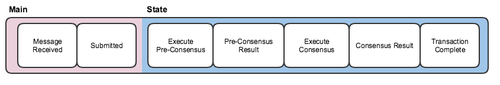

Planning the Implementation
===========================

Our application is used to ensure that eveyone's cats have unique names.  Users will register their cats' names with the system, which prevents people from claiming a cat name which has already been claimed by someone else.  Users should also be able to see who owns which cat.

From this simple list of requirements, we know that we're going to need the following:
* A data object that represents the ownership of each cat name.
* A structure to hold all of the ownership records.
* A log of all of the successful transactions that added cats/owners.
* A transaction that adds a new cat/owner pair to the ledger, first checking to ensure that the cat's name hasn't already been claimed by someone else.
* A query that returns all of the cat/owner pairings.

## Mapping Requirements into the Aviator Pipeline Programming Model

### Transaction Types
Every interaction in an Aviator application is represented by a unique transaction type.  In effect, an Aviator application supports *only* the list of transaction types defined.

In the case of our application, we have two:  
* "Get Cats", which lists all of the cat/owner pairings in the system
* "Add Cat", which adds a new cat/owner pairing.

### Aviator Messages
Transactions and their related data are encapsulated in an Aviator message.  For example, Carol wants to register her cat Snowflake with the application.  We generate an Aviator message that looks somethign like this:
```json
{
    transactionType: "Add Cat",
    payload: {
        cat: "Snowflake",
        owner: "Carol Beer"
    }
}
```
As the message moves through the system, it will collect information about its current status and the results of actions taken on the message.

### Pipeline Stages



Aviator applications are developed using a programming model called the pipeline.  The pipeline provides a consistent, platform-independent transaction processing flow that isolates developers from the mechanics of the underlying platform.  At each step in the pipeline, developers have the option to apply business logic or report status back to calling applications.  A transaction can also be interrupted at any stage.  An interrupted transaction skips all of the remaining pipeline stages and is routed directly to the "transaction complete" stage.

For the purposes of this walkthrough, there are three pipeline stages you'll need to understand.  

#### Message Received
The "message received" stage is the first stage in the pipeline.  It occurs immediately after a message has been inserted into the pipeline, and before the framework submits the transaction to the network.  Developers can use this stage to validate a transaction before submitting to the network, or to process read-only requests.  In our application, we will hook into the "message received" stage to return the list of cats and their owners.

#### Execute Consensus
The "execute consensus" stage is triggered when a transaction is received from the network at consensus.  At this stage, we have confidence that the network has come to an agreement on the order in which transactions are to be processed, and we can apply changes to the shared state.  We will use the "execute consensus" stage to process requests that add cat/owner pairs to the shared state.

#### Transaction Complete
The "transaction complete" stage is the final stage in the pipeline.  This stage is unique in that it is guaranteed to be called last for every transaction, no matter what.  We can use this stage to report final results back to a calling application, even if an exception has occurred somewhere else in the pipeline.  Once "transaction complete" happens, the framework will take no further action on a transaction.

We will use "transaction complete" to tell the calling application whether or not an owner has been able to successfully register their cat.

## Next Steps
Now that we have identified our application's requirements and mapped them onto the Aviator concepts we need to implement our application, we can get our project set up and start writing code.  Let's move on to [Create a Java Project and Set Up Maven Dependencies](Maven.md)